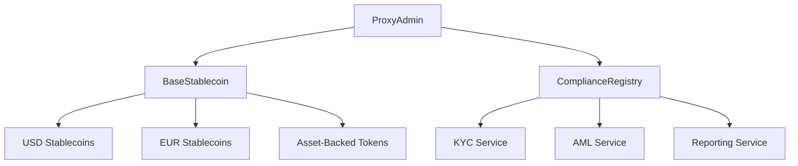

# DeFi Oracle Meta Protocol

A comprehensive DeFi protocol with upgradeable smart contracts, multi-currency stablecoin support, and advanced compliance features.

## Overview

The DeFi Oracle Meta Protocol provides a secure and compliant infrastructure for stablecoin operations, featuring:

- 🔒 Upgradeable smart contracts (UUPS pattern)
- 🌐 Multi-currency stablecoin support
- ✅ Built-in KYC/AML compliance
- 🔄 Cross-chain bridge functionality
- 📊 Advanced price feed aggregation
- 💱 Automated market making
- 🏦 Yield generation
- 🛡️ Comprehensive security features


## Technical Architecture

### Smart Contracts
- `StablecoinProxyAdmin`: UUPS upgradeable proxy admin contract
- `ComplianceRegistry`: KYC/AML compliance management
- `BaseStablecoinV2`: Base implementation for stablecoins
- `USDC`, `USDT`: Specific stablecoin implementations
- `StablecoinSwap`: DEX functionality
- `Vault`: Yield generation vault

### Security Features
- Multi-role access control
- Timelock for upgrades (2 days)
- Emergency pause functionality
- Comprehensive monitoring system

### Deployment Process
```bash
# Install dependencies
pnpm install

# Compile contracts
pnpm compile

# Deploy contracts
pnpm deploy

# Verify deployment
pnpm verify

# Setup security
pnpm run setup-security

# Setup monitoring
pnpm run setup-monitoring
```




## Supported Tokens

### USD Stablecoins
- USDC (USD Coin)
- USDT (Tether USD)
- DAI (Dai Stablecoin)
- BUSD (Binance USD)
- USDP (Pax Dollar)

### EUR Stablecoins
- EURS (STASIS EURO)
- EURT (Euro Tether)

### Asset-Backed Tokens
- PAXG (Paxos Gold)
- XAUT (Tether Gold)

### Regional Stablecoins
- JPY (Japanese Yen)
- CNY (Chinese Yuan)
- HKD (Hong Kong Dollar)
- KWD (Kuwaiti Dinar)
- AED (UAE Dirham)

## Prerequisites

- Node.js v16+
- Yarn
- Hardhat
- OpenZeppelin Contracts ^4.9.0
- Solidity ^0.8.19

## Quick Start

1. Clone the repository:

```bash
git clone https://github.com/your-org/defi-oracle-meta.git
cd defi-oracle-meta
```

2. Install dependencies:

```bash
yarn install
```

3. Configure environment:

```bash
cp .env.example .env
# Edit .env with your configuration
```

4. Compile contracts:

```bash
yarn hardhat compile
```

5. Run tests:

```bash
yarn hardhat test
yarn hardhat coverage
```

## Deployment

1. Deploy core infrastructure:

```bash
yarn hardhat run scripts/deploy/orchestrator.js --network mainnet
```

2. Configure security settings:

```bash
yarn hardhat run scripts/security/setupSecurity.js --network mainnet
```

3. Verify deployment:

```bash
yarn hardhat run scripts/verify/verifyAll.js --network mainnet
```

## Security Features

- Multi-signature requirements
- Timelock for upgrades (48 hours)
- Emergency pause functionality
- Comprehensive access control
- Automated compliance checks
- Circuit breakers
- Real-time monitoring

## Compliance Integration

- KYC/AML verification
- Transaction monitoring
- Regulatory reporting
- Jurisdictional controls
- Sanctions screening
- Risk assessment

## Development

### Testing

```bash
# Run all tests
yarn test

# Run specific test
yarn test:unit test/specific-test.js

# Generate coverage report
yarn coverage
```

### Linting

```bash
# Run linter
yarn lint

# Fix linting issues
yarn lint:fix
```
## Documentation

- [Smart Contract Architecture](docs/ARCHITECTURE.md)
- [Security Model](docs/SECURITY.md)
- [Upgrade Process](docs/UPGRADES.md)
- [Compliance Integration](docs/COMPLIANCE.md)
- [Deployment Guide](docs/DEPLOYMENT_CHECKLIST.md)

## Monitoring & Maintenance

- Real-time transaction monitoring
- Automated alerts
- Performance metrics
- Compliance reporting
- Emergency response system

## Contributing

1. Fork the repository
2. Create your feature branch
3. Commit your changes
4. Push to the branch
5. Create a Pull Request

## Security

For security concerns, please email security@example.com

## License

MIT License - see [LICENSE](LICENSE) for details

## Support

- Documentation: [docs.example.com](https://docs.example.com)
- Discord: [discord.example.com](https://discord.example.com)
- Email: support@example.com

## Acknowledgments

- OpenZeppelin for security contracts
- Chainlink for price feeds
- The Graph for indexing
