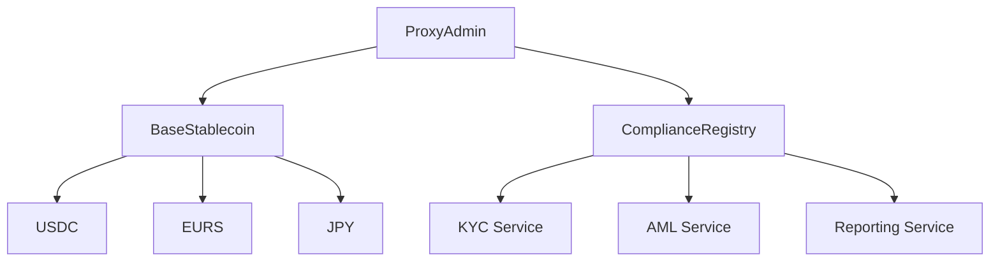
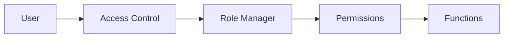
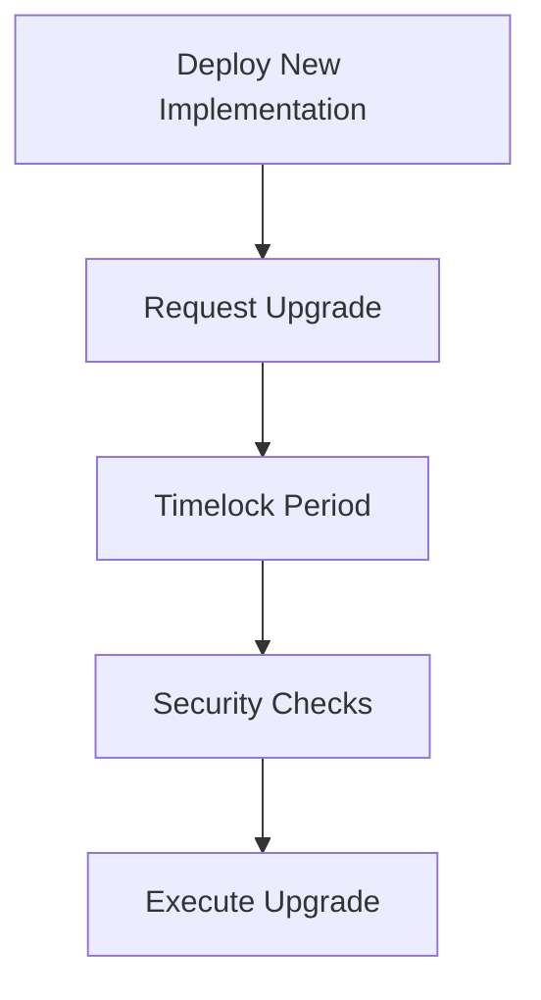
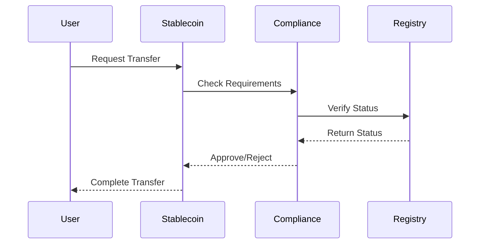

# Smart Contract Architecture

## System Overview



## Core Components

### ProxyAdmin
- Manages upgrades for all contracts
- Implements timelock mechanism
- Controls emergency functions
- Manages access control

### ComplianceRegistry
- Centralized compliance management
- KYC/AML status tracking
- Regulatory reporting
- Transaction monitoring

### BaseStablecoin
- Core stablecoin functionality
- Upgrade mechanisms
- Compliance integration
- Emergency controls

## Security Architecture

### Access Control Layer


### Upgrade Process


## Data Flow

### Transaction Flow


## Integration Points

### External Services
- KYC Provider Integration
- AML Monitoring
- Regulatory Reporting
- Price Feeds

### Internal Services
- Transaction Monitoring
- Compliance Reporting
- Emergency Response
- Upgrade Management

## Storage Layout

### Proxy Storage
```solidity
contract StablecoinStorage {
    // Core storage
    mapping(address => uint256) private _balances;
    mapping(address => mapping(address => uint256)) private _allowances;
    uint256 private _totalSupply;
    
    // Compliance storage
    mapping(address => bool) public isWhitelisted;
    mapping(address => bool) public isBlacklisted;
    
    // Upgrade storage
    address private _implementation;
    address private _admin;
}
```

## Error Handling

### Error Codes
| Code | Description | Mitigation |
|------|-------------|------------|
| E001 | Invalid compliance status | Verify KYC/AML |
| E002 | Transfer limit exceeded | Check limits |
| E003 | Upgrade failed | Verify implementation |
| E004 | Emergency pause | Wait for resolution |

## Gas Optimization

### Strategies
1. Batch operations
2. Storage packing
3. Memory vs Storage optimization
4. Loop optimization

## Monitoring

### Key Metrics
- Transaction volume
- Gas usage
- Error rates
- Compliance status 